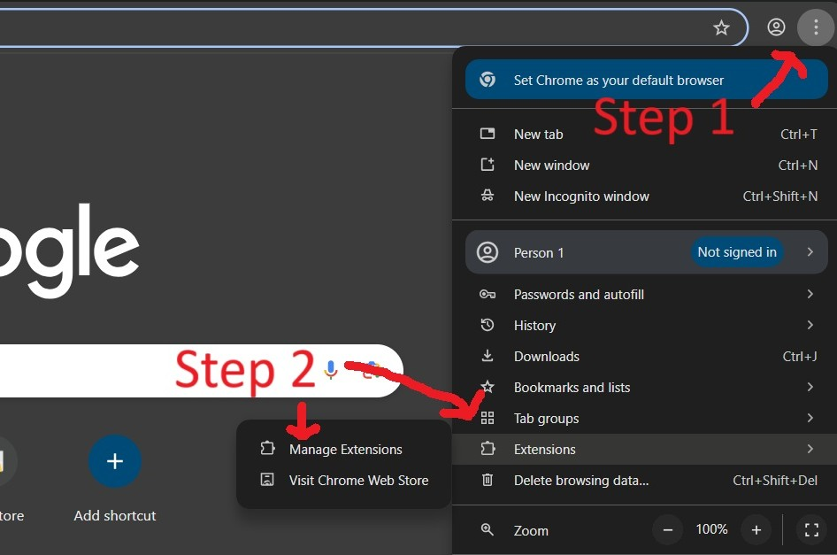
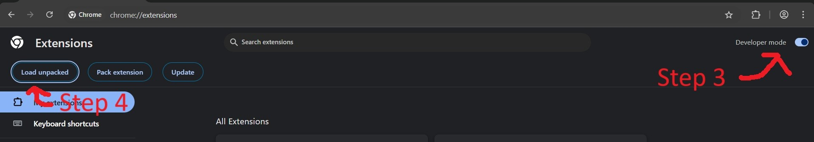
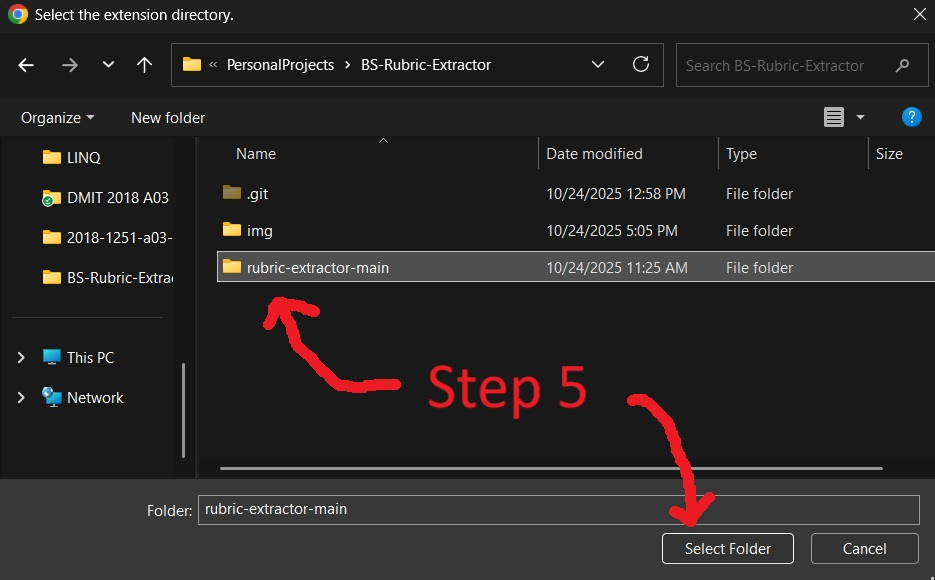
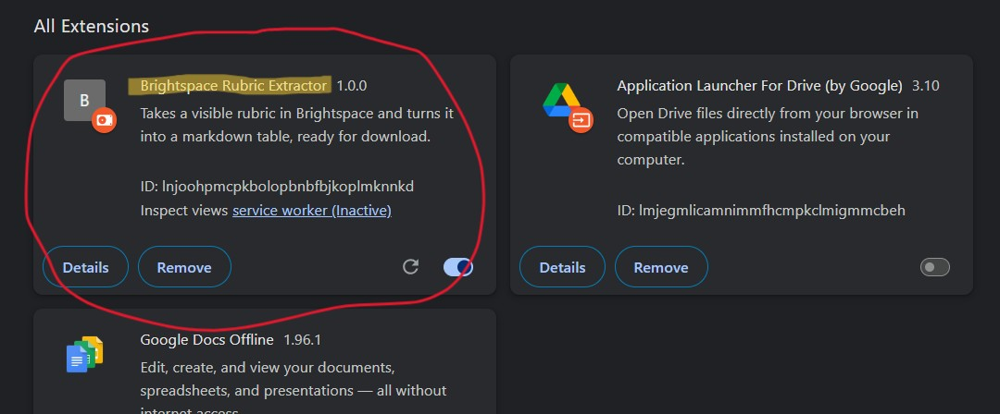

# Installation

Currently, Google asks for a *$5 fee* for a developer account in order to start uploading to their **web extensions store**.

For now, you'll have to load this thing unpacked. Here's how:

***Prerequisite:** Clone this repo first to get the extension.*

1. *(Simply visit from the address bar with the URL `chrome://extensions`, or)* On your broswer, click the icon with the 3 dots *(3 lines on **Brave/Firefox** | On **Opera**, there's an extensions button on the left bar)*
2. Click on the ***Manage Extensions*** button.

3. Toggle on ***Developer mode***.
4. Click on ***Load unpacked***.

5. Navigate to this Git repo and select the `rubric-extractor-main` folder.

**Result** - If all goes well, the extensions should show up in the *All Extensions* list.

# Usage

