# Installation

Currently, Google asks for a *$5 fee* for a developer account in order to start uploading to their **web extensions store**.

For now, you'll have to load this thing unpacked. Here's how:

***Prerequisite:** Clone this repo first to get the extension.*

1. *(Simply visit from the address bar with the URL `chrome://extensions`, or)* On your broswer, click the icon with the 3 dots *(3 lines on **Brave/Firefox** | On **Opera**, there's an extensions button on the left bar)*
2. Click on the ***Manage Extensions*** button.

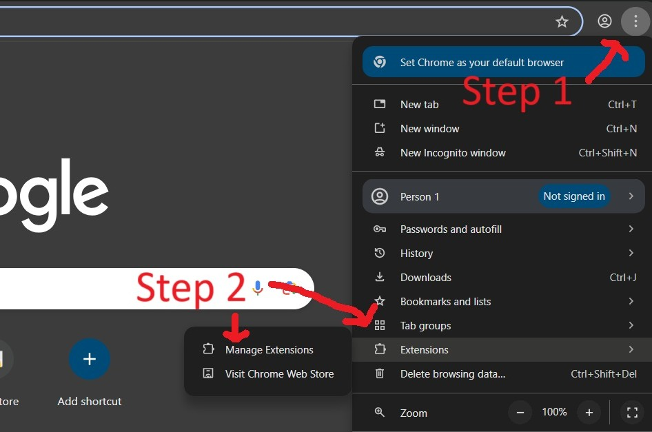

3. Toggle on ***Developer mode***.
4. Click on ***Load unpacked***.

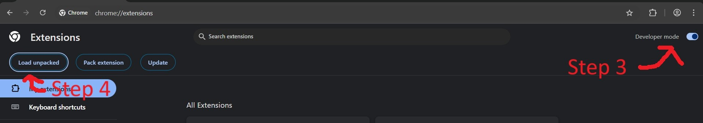

5. Navigate to this Git repo and select the `rubric-extractor-main` folder.

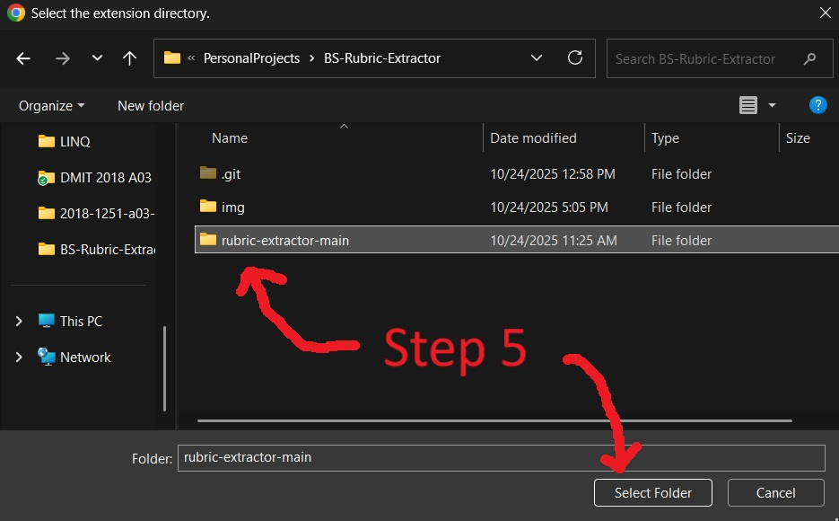

**Result** - If all goes well, the extensions should show up in the *All Extensions* list.

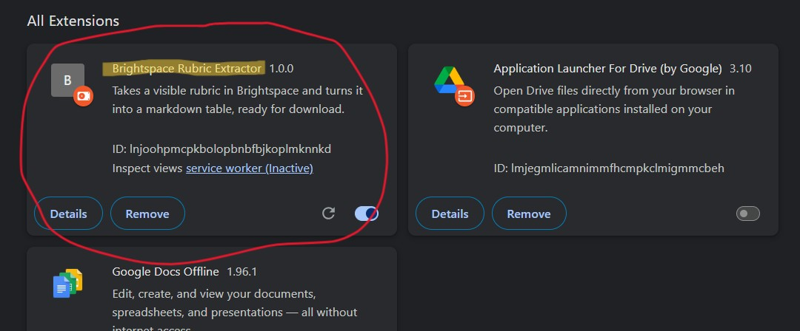

# Usage

Once you have it installed, pin the extension and extract away!

1. Click the extensions button on the top bar.
2. Click on the pin icon to put this extension's start button on the top bar. At this point, you're ready to use the extension.

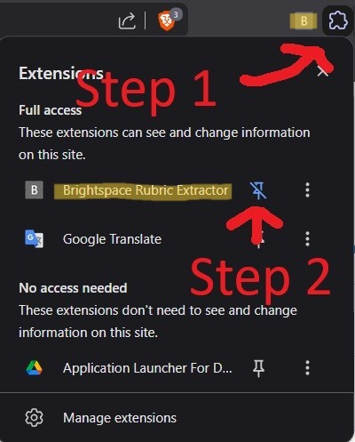

3. Navigate to your desired assignment page and make sure the rubric there is visible. *(**NOTE:** If the webpage is too small, Brightspace activates **compact** mode. The extractor is yet to have functionality to extract from that yet and will say that there's no rubric detected.)*

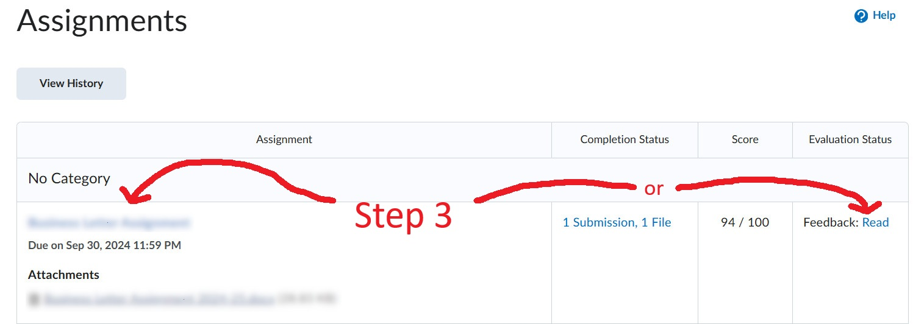

Some assignments have rubrics; others, *unfortunately*, do not.

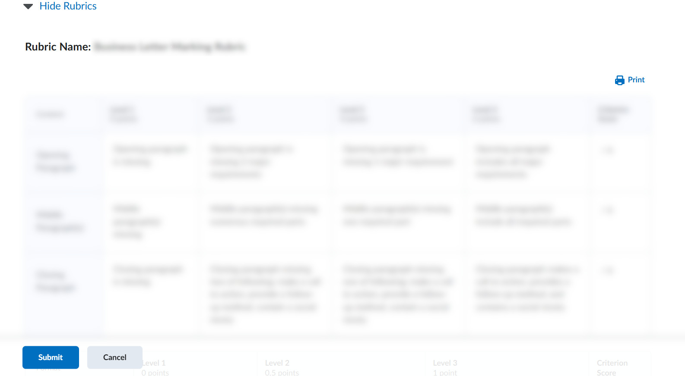

4. Click on the *extension button* that you pinned.
5. Select which format you want, and click download. *Voila!* you have extracted the rubric.

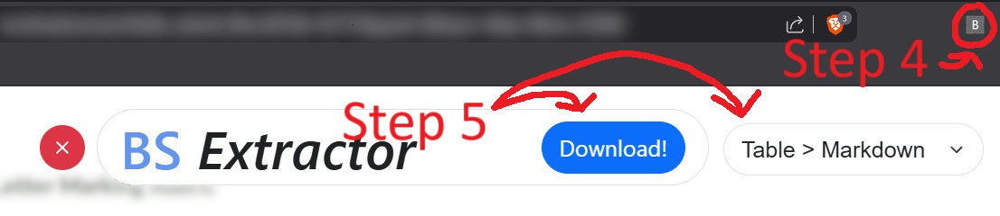

## A Note On Viewing Markdown

Congratulations! You've extracted the rubric on a more readable and shareable format! Open the file in Visual Studio Code or notepad to see it.

There are also other ways to view Markdown files. Here's a non-exhaustive list of other programs that view Markdown:

- **Github** - The file you're currently reading is written in Markdown. If you look at the raw file, you'll see the syntax used to format this document. *I don't think you'll ever be uploading a rubric to Github, and coding assignments have their rubrics already in their repositories' readmes anyway*. But it is possible to do it if you really want.

- **~~Discord~~** - Messages in Discord can use Markdown syntax to flavor their text. However, they use a custom, smaller version of Markdown with less features. ***This sadly does not include tables.*** See their [Markdown formatting page](https://support.discord.com/hc/en-us/articles/210298617-Markdown-Text-101-Chat-Formatting-Bold-Italic-Underline) for details. *A Markdown format using an unordered list (they are usable in Discord) is a planned feature.*

- **Note Taking Apps** - Some note taking apps can easily import markdown files and convert it to their format. Look for an import option in the menus or just look it up online.
    - **Notion**
    - **Obsidian**
    - **Zettlr**
    - **Notable**
    - *etc.*

- ***Others!*** - A lot of programs use Markdown for their simplistic syntax for styling text. Just be on the lookout and see if the ones you use support it.

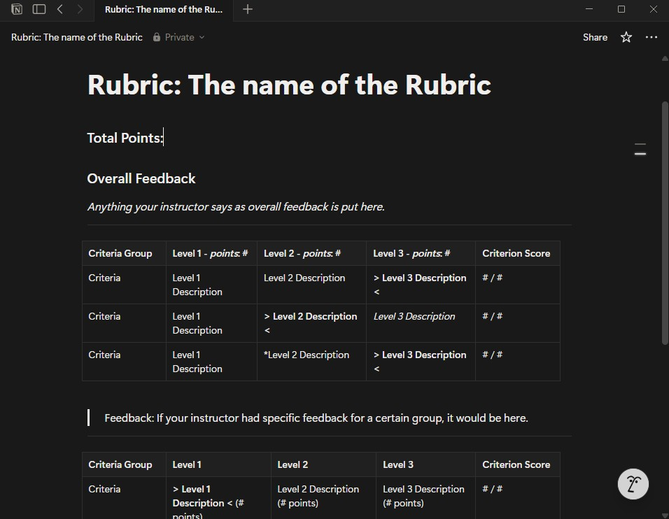

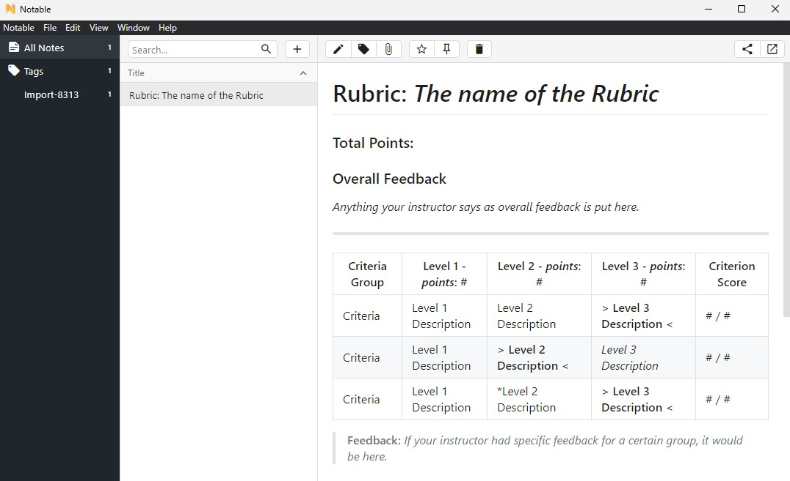

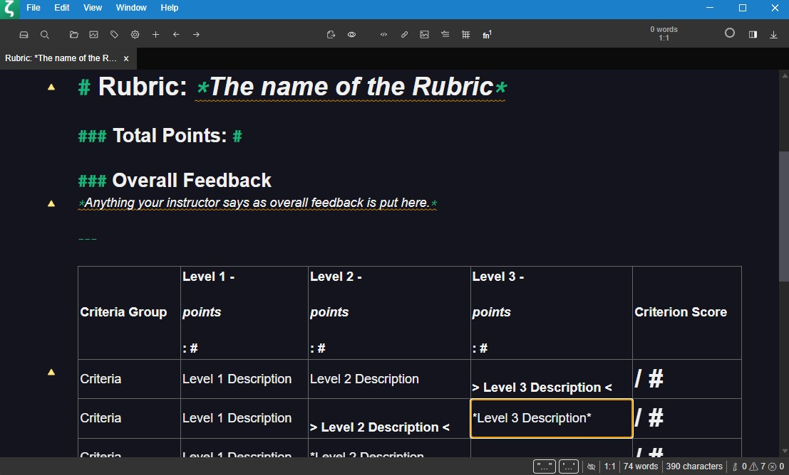

*Ok, maybe the rubric doesn't translate very well to Zettlr's way of formatting Markdown.*
